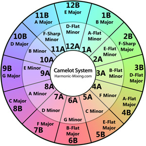

# matlabmusic
A few MATLAB scripts to help with music mixing.

# Description

There are two main programs, written in MATLAB code, that help DJs create bootlegs and mashups of different songs. For two songs to mix together, they need to: (A) be in the same key (or in compatible keys) and (B) have a similar tempo. As it can be quite time consuming searching for songs that fit into these parameters, the two scripts aim to reduce the time/effort taken to find songs compatible for mixing.

A knowledge of basic music theory is assumed. Key terms are: BPM, major and minor keys, circle of fifths, compatible keys, Camelot Mixing Wheel (http://www.harmonic-mixing.com/howto.aspx).

**Harmonic_mixing_program**

Often, two songs with similar BPMs are not in the same key. However, if one of the songs is in the relative fifth key of the other, then they sometimes still sound good together. If their keys are *not* a fifth apart, sometimes their pitch can be shifted one semitone up or one semitone down; which will then make them a fifth apart from the first song - and therefore mixable. Many mixing and editing softwares have the capability to move the pitch of a song by one or more semitones - however usually, after moving the song by more than one semitone, audio quality is noticeably lost (at least in my experience) therefore, this script sticks to finding compatibility by moving just one semitone up or down. Here's an example to demonstrate:

**Example**

Song A has a tempo of 100 BPM and is in the key of C major (8 B) while Song B has a tempo of 95 BPM and is in the key of A flat major (4 B). The tempos are close enough that they can be mixed together.
However, the keys are not compatible. If you're musical you'll know these two keys are not relative fifths apart, which means the songs cannot be harmonically mixed together. BUT we can move Song B down one semitone to G major (9 B) - this will then mix with Song A's key of C major! See the Camelot Mixing Wheel below to see which keys are compatible with each other (adjacent keys are):

Note: You may ask, why can't we just move the key of Song B (A flat major) straight to C major? The answer is that this would be a jump of 8 semitones - which often massively distorts sound quality in current DJ software.

This script essentially asks for user input for the keys of two separate songs, then displays a message showing how to manipulate the keys of the individual songs such that they both mix. 

**Music_mixability_program**

Not the best name but this script essentially takes in a list of songs, their keys and their BPMs. It then outputs a matrix showing which songs mix with which others in the list, based on the parameters of their BPMs and keys. The current program is tuned so that songs with BPMs +/- 5% of each other and compatible keys based on the Camelot Mixing Wheel are labelled as compatible overall.

# Dependencies

The two main scripts are harmonic_mixing_program and music_mixability_program. For the rest, files with a 'harmonic' (e.g. harmonic_compare) or 'music' (e.g. music_letkey) prefix are required for the harmonic mixing and music mixing programs respectively only, whilst files without the prefix are required for both to run. In addition, a .xlsx file containing song names, BPMs and keys should be in the working directory, for music_mixability_program to work (not required for the harmonic mixing program). How to get this is listed below:

# Getting a .xlsx file with music data for music_mixability_program
*First, download the repo and save it in a relevant working directory.*

1) Next, you need .mp3 files of all the songs you want to mix.
2) Go to https://www.audiokeychain.com/ and drag and drop you mp3 files or click 'Add Tracks' to add them. Once they're all added, click 'Upload Tracks' to upload them to the website - this might take a while depending on your internet speed.
3) Once they have all been analysed and their BPMs and keys have been listed, click 'Export List' and save the .csv file in the relevant working directory.
4) Open the .csv file and save it as a .xlsx file - DON'T CHANGE THE FILE NAME, as it has to be called 'AudioKeychain_export.xlsx' for the script to recognise it.
5) Open MATLAB and run the relevant scripts!
